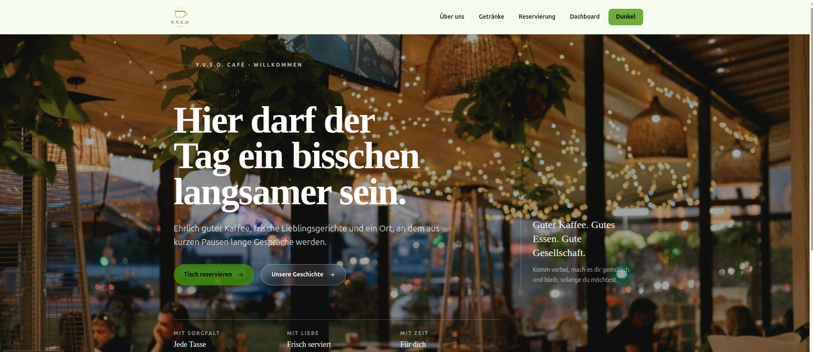

# ☕ Y.V.S.O. Café

Y.V.S.O. Café ist eine responsive Café-Webanwendung mit digitaler Getränkekarte und vollständiger Reservierungsverwaltung. Gäste können sich über das Café informieren und Tische reservieren. Das Dashboard stellt die gespeicherten Reservierungen übersichtlich dar und bietet Kennzahlen, Suche, Filter und Sortierung.



## 👥 Teammitglieder

- Yana Khariebova
- Vladislav Nedbailo
- Szymon Malinowski
- Olha Khodakivska

## ✨ Features

- Responsive Startseite sowie Seiten für „Über uns“, Getränkekarte und Impressum
- Dynamische Getränkekarte mit Daten von [TheCocktailDB](https://www.thecocktaildb.com/api.php)
- Reservierungen erstellen, anzeigen, bearbeiten und löschen (CRUD)
- Formularvalidierung mit verständlichen Fehlermeldungen
- Auswahl verfügbarer Uhrzeiten passend zu den Öffnungszeiten in 15-Minuten-Schritten
- Speicherung der Reservierungen im Browser über `localStorage`
- Dashboard mit Kennzahlen, aktuellen Reservierungen, Suche, Filtern und Sortierung
- Helles und dunkles Theme mit gespeicherter Benutzerauswahl
- Lade-, Fehler- und Leerzustände für eine klare Benutzerführung

## 🛠️ Verwendete Technologien

- React 19 und TypeScript
- Vite
- TanStack Router
- TanStack Query
- TanStack Form
- Zod
- React Context API und React Hooks
- Tailwind CSS 4 und daisyUI
- TheCocktailDB API
- Browser-`localStorage`
- ESLint

## 📦 Installation

Voraussetzung ist [Node.js](https://nodejs.org/) in Version `^20.19.0` oder `>=22.12.0` sowie npm.

```bash
git clone <repository-url>
cd yvso-cafe
npm install
```

## 🚀 Projekt starten

Den Entwicklungsserver starten:

```bash
npm run dev
```

Anschließend die von Vite im Terminal ausgegebene lokale Adresse im Browser öffnen.

Weitere Befehle:

```bash
npm run build    # Produktions-Build erstellen
npm run lint     # Code mit ESLint prüfen
npm run preview  # Produktions-Build lokal anzeigen
```

## 🗂️ Projektstruktur

```text
yvso-cafe/
├── markdown/              # Aufgabenstellung und Projektnotizen
├── public/                # Bilder, Logos und weitere statische Dateien
├── src/
│   ├── components/        # Wiederverwendbare UI- und Formular-Komponenten
│   ├── config/            # Kontaktdaten und Öffnungszeiten
│   ├── hooks/             # TanStack-Query-Hooks für Reservierungen
│   ├── routes/            # Dateibasierte Seiten und Routen
│   ├── schemas/           # Zod-Schema für Reservierungen
│   ├── services/          # Reservierungs- und Getränke-Datenzugriff
│   ├── types/             # Gemeinsame TypeScript-Typen
│   ├── main.tsx           # App-Einstieg und Provider
│   └── index.css          # Globale Styles und Themes
├── package.json           # Abhängigkeiten und npm-Befehle
└── vite.config.ts         # Vite- und Router-Konfiguration
```

## 🤝 Aufgabenverteilung im Team

| Teammitglied | Aufgabenbereich |
| --- | --- |
| Szymon Malinowski | Projektsetup, Routing, Layout und Navigation, Start-/Über-uns-/Menü-/Impressumsseiten, Getränke-API und UI-Polishing |
| Vladislav Nedbailo | Datenmodell, Mock-Service mit `localStorage`, TanStack Query, CRUD-Hooks sowie Lade- und Fehlerbehandlung |
| Yana Khariebova | Reservierungsformular, Erstellen- und Bearbeiten-Routen, Zod-Validierung, Datums-/Zeitauswahl und Spinner |
| Olha Khodakivska | Dashboard, Kennzahlen, Suche, Filter, Sortierung, Empty State, Theme-Context und responsive Optimierung |

## ℹ️ Datenhinweis

Reservierungen werden ausschließlich im `localStorage` des verwendeten Browsers gespeichert und nicht an einen Server übertragen. Für das Laden der Getränkekarte wird eine Internetverbindung benötigt.
